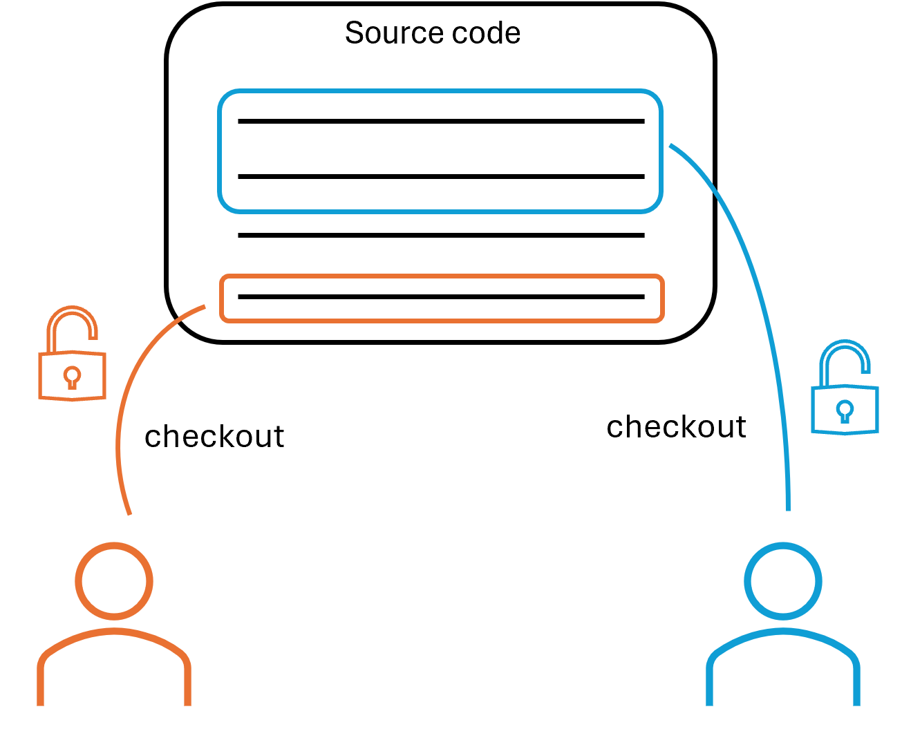
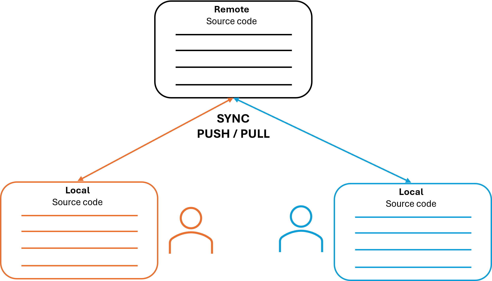

# Preamble : What is version control ?

This part aim to describe some technical terms to better get into the purpose of this workshop.

## Common language breakdown

First thing to know : `Git is only a version control tool`.

Many tools and methodologies have been created throughout the years to handle this IT development aspect (BitKeeper, SVN, CVS, etc.).

`Git` is the standard tool nowadays that's why we more often use this term instead of `version control` or `code source control`.

## Version control objectives

As the name implies, version control allows developpers to do `file versionning` (instead of having multiples different copies of it :dizzy_face:).

Gains are : 
- Only one source of truth at a time (ie one file)
- Enabling collaboration
- Encouraging consistency (branching / commit strategy)
- Allowing work history and immutability
- Integrating CI-CD pipelines
- etc.

## Version control types

There two major version control types : `centralized` and `distributed`.

### Centralized

As the name implies, it consist of having only one repository where every developpers can interact with simulatenously.

The main issue with this method is that everytime a developper would work with one or many files, he **locks** it so that it avoids conflict with other developpers.

Therefore two developpers cannot work at the same time on a single file : that really unfortunate in almost all projects. :confused:

### Distributed

Distributed method resolve this locking issue by providing : 
- a remote repository 
- a local copy for each user

Leveraging sync between those repositories, developpers can now work on the same file.

:bulb: Remember this : **there's no silver bullet in IT dev, everything come with a cost**.

Distributed version control doesn't deviate from the rule : the main issue is **conflicts management**. :bomb:

Fortunately, several methods exists to make it fluent. :sparkles:

## Git Birth

Git was created by **Linus Torvalds in 2005** out of necessity when the Linux kernel community needed a fast, reliable, and distributed version control system after losing access to the proprietary BitKeeper tool they had been using.

Unlike centralized systems such as SVN or CVS, where all developers work on a single central repository that can become a bottleneck, Git is distributed : `every developer has a full copy of the entire project history locally`. This design allows for better collaboration, offline work, and faster operations.

Git also introduced efficient handling of branching and merging, making parallel development smoother and less error-prone compared to earlier tools.

Linus developed Git with simplicity in mind, focusing on a few basic commands (`git merge`, `git blame`, `git log`, `git commit`, and `git pull`) and primarily managing saving folders and files along with basic graph management.

Since these day Git has grown in popularity and became the `version control tool standard`.

## Time to Peek Inside Git
Now that you understand what version control is and why it’s essential in IT development, it’s time to get your hands dirty with Git itself.

In the next step, you’ll create your first local Git repository and peek inside to see how Git organizes and tracks your work behind the scenes.

Ready to explore Git under the hood?

:arrow_right: Move on to [next step](step1_git_under_the_hood.md).