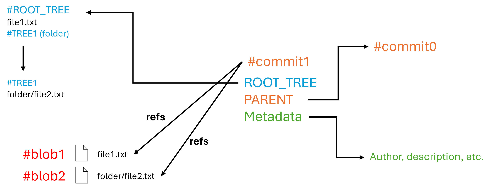
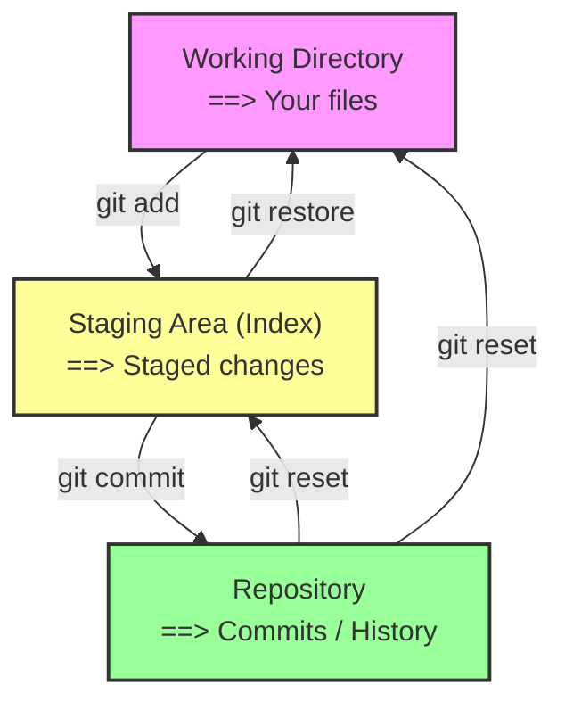

# Getting Your Hands Dirty: Git Under the Hood

In this step, you’ll create your first local Git repository and explore what’s happening behind the scenes. 

We’ll look inside the .git directory, understand Git’s internal objects like SHA-1 hashes and trees, and demystify Git’s staging areas : working directory, staging area, and repository.

## First repository

Make sure you follow the prerequisites by installing [mandatory tools](../README.md#tools).

Create a directory wherever you want named `first-repo`, open a terminal in it and run the following git command : 

```bash
git init
```

Et voilà ! Your first local repository have been created :star2:

But wait we don't see anything in there :question:

&rarr; Make sure you **allow hidden directory to be displayed**.

After you should see a `.git directory` appears.

Before diving into what it contains we should understand how Git is working under the hood.

## Git internals

We can sum git behavior in few points : 

:one: Each **file in a repository are stored as a blob object** and compressed using z-lib

:two: Each **directory are stored as a tree object** listing filenames, type (file or directory)

:three: A **commit object points to the root tree object**, and therefore the repository content, at a given time. 

:four: A **commit can have a parent except the initial one**.

:five: A **commit also store additionnal metadatas such as description or author**

:six: Git **associate a SHA-1 hash to each object** to ensure their integrity

Below is a schematic representation illustrating these concepts :



## .git directory

Let's now focus on how Git is storing all those objects : that's the purpose of the **.git folder**.

```
.
├── .git/│   
│   ├── ▶ hooks/    <- keep it for later ... 😏
│   ├── ▶ info/     <- unshared per repository settings and metadata (rarely used)
│   ├── ▶ logs/     <- git commands logs
│   ├── ▶ objects/  <- blobs, trees and commits objects
│   ├── ▶ refs/     <- branches references
|   ├── config       <- shared per repository settings and metadata (often used)
|   ├── description  <- optional file for informational purposes
|   └── HEAD         <- current HEAD
└──  ...
```

:bulb: Some tools like `Fork` could also add additionnal files for instance : 
- `COMMIT_EDITMSG` & `COMMITMESSAGE` to store the current commit message description written in the GUI
- `fork-settings` to store repository settings specific to Fork
- etc.

### Config file

Each repository contains a `config file`. It is responsible to store repository git specific settings. 

:bulb: This means there's a default one, on windows it is stored here : `C:\Users\<YourUserName>\.gitconfig`

There's plenty of [git configs](https://git-scm.com/book/fr/v2/Personnalisation-de-Git-Configuration-de-Git), let's focus about two baisc ones : 

- Setting up default user

&rarr; Allowing you to define the Author displayed when you will create commits

```
git config --global user.name <YourDisplayName> 
git config --global user.email <YourEmail>
```

:bulb: If you opened `Fork` after installing it, you may have seen a popup asking you to fill a name and email input, under the hood it basically run those commands

- Setting up default branch

&rarr; Allowing you to define the default when you create a repository

```
git config --global init.defaultBranch main
```

:bulb: Many Git provider (such as GitLab, GitHub, Azure Devops and so on), uses main as default branch.


> If you want to make a repository specific config, just replace `--global` option by `--local`. You can also use the command `git [--global | --local] --list` to list whether repository or global specific config without opening files.

### objects folder

This directory is responsible to store every Git objects as compressed files. 

Each filename is object associated SHA-1 hash and its content is basically the z-lib compressed content.

For performance purposes all files are splitted into folders named with the two first SHA-1 hash characters, files under are therefore named with the last thirty-eight ones. It's a common technique called `sharding` or `partitionning`.

### refs, HEADs and branches

In Git, the terms `refs, heads, and branches` are **related but mean slightly different things**, and they’re often mixed up. Here’s a simple way to understand them :

:one: `Refs are general pointers` that Git uses to keep track of specific commits, branches, tags, remotes, etc. Think of refs as labels or bookmarks that tell Git where important commits are.

:two: `Heads are a specific type of ref`. They **point to the latest commit on your local branches**. So, heads are refs that represent your active development lines on your computer.

:three: A `branch is what you usually think of when you hear “branch”, it’s the name you give to a development line`. Under the hood, a **branch is just a named pointer to a commit**.

We could also talk about `tags` that are basically labels attached to a specific commit. We often use it to mark the code at a given time and associate a version like **v1.0.0** for instance.

Therefore inside ./git/refs directory you'll find :

```
.
├── refs/│   
│   ├── ▶ heads/    <- one file per branches in local repository containing the last commit hash inside
│   ├── ▶ origin/   <- contains a folder for each remote sources and inside its related /refs folder
│   └── ▶ tags/     <- one file per tags in local repository containing the commit hash inside│   
└── ...
```

:bulb: Path to `./refs/heads/**` and `./refs/origin/**` are also stored in `HEADs files` at **./git root directory** for performance purposes : 
- `HEAD` 
- `FETCH_HEAD` / `ORIGIN_HEAD` &rarr; you'll see them appears when we'll talk about [collaborating with git](./step3_collaboration_essentials.md)

## Staging areas

To manage changes efficiently, Git organizes your work into three areas (sometimes called **staging areas** or **states**) :

:one: `Working directory` : This is where you edit files directly on your computer. These files are just the regular files you see and modify — Git tracks their content, but at this stage, changes are unstaged and unrecorded.

:two: `Stage` (Index) : Also called the **index or cache**, this is a **temporary buffer** where you prepare (or stage) changes before committing. When you add files into it, Git records the changes here by storing the file’s hash and metadata. This lets you control exactly which changes will be included in your next commit.

:three: `Repository` : This is where Git permanently **stores commits**. When you create a commit, Git takes the staged changes from the index and saves them as a new commit object in the repository.

Below is a schema resuming how changes leads to commit creation with related git commands : 



:bulb: Few additionnal points could be mentionned in there : 
- Changes cannot be persisted from Working Directory to Repository without being staged
- Changes persisted in Repository can directly reset to Working directory
- Differences can be computed using `git diff` command between two staging areas
- `--soft`, `--mixed`, `--hard` are options allowed in many git commands and respectively points to Repository, Stage and Working Directory staging areas

## From theory to practice 

Ready to move from theory to practice ? Next, you’ll learn how to use Git’s essential commands to manage your code locally leveraging [Fork GUI](https://git-fork.com/).

:arrow_right: Jump to [next step](./step2_basic_local_commands.md).