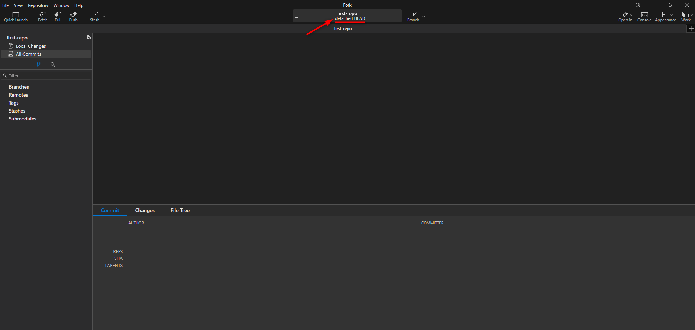
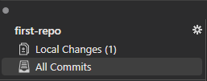
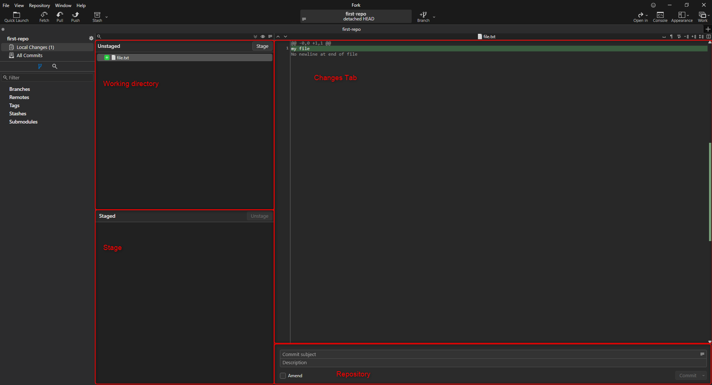
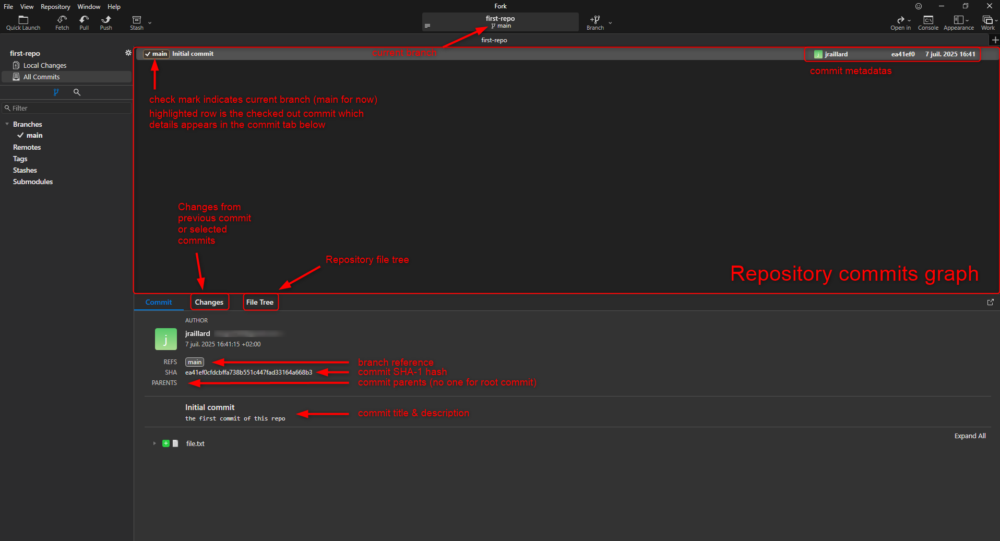
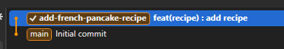
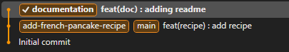
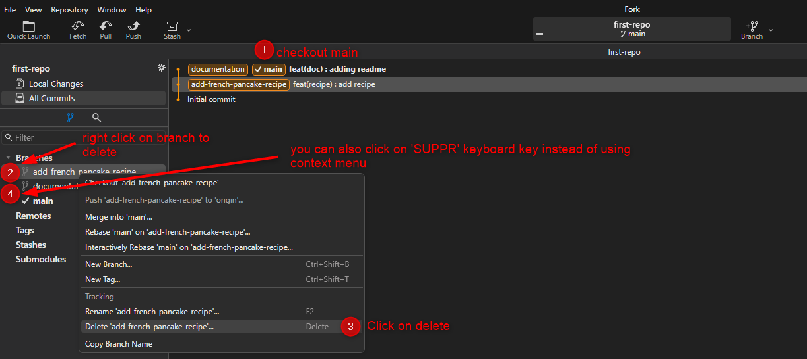

# Basic Git Commands in Action

Now that you know what’s under Git’s hood, it’s time to get hands-on with the core commands : commit your changes, create and switch branches, and merge your work. 

These commands form the foundation for effective version control in your projects.

## Get on your repository

Open **Fork**, go on `File / Open Repository` and look for you previously created `first-repo` repository.

You should see something like this :



Notice what I underlined ***detached HEAD***, what the hell is it ? :dizzy_face: 

When you create a repository no changes are in there or even already persisted, so you can't have a HEAD as no commits are created.

So let's create our first one : 
- Create a file named `file.txt` in your repository root and write "my file" inside
- Go back to fork and observe that changes have been detected : 
- Click on **Local changes** tab, you should be redirected to a page where you can observe all staging areas we mentioned earlier

    - To persist from Working Directory to Stage &rarr; basically select files and clic on **Stage** (:bulb: if we add multiple lines and mades changes in few ones we might also be able to select changes inside files instead of the entire file)
    - To persist from Stage to Repository &rarr; Basically Add a **commit subject** and optionnaly a description (that will be part of commit metadatas) and click on **Commit**
- Come back to **All commits** tab and you should see you're first commit

:sparkles: As you can see now we have a **HEAD** &rarr; **main** which we defined as the default branch in the git global config previously :smirk:

## Using branches

Let's say you're on a project you have two given tasks :
- add a file containing the french pancake recipe
- add a README file to provide documentation about this repository

You might be tempted to add all of this in a single commit ; but you won't. :eyes:

> **Commits should be atomic**, meaning they should focus about one thing (feature, fix, etc.).

Ok then, I'll create the french pancake recip file in a first commit and add the README file in a second on ; is that ok ?

&rarr; That's better but there's another approach : using `branches` :bulb:

> **Git branches** allows us to isolate changes in a commit chain. Few points / rules to know about branches
> - a branch is a label of its first commit
> - branches should be as atomic as possible
> - a branch is created from another (despite the default one)
> - a branch should be short-lived, or long-lived but **for good reasons**
> - a branch can be merge into another using the command `git merge`
> - a branch can be rebased (meaning changing the first commit parent) using the command `git rebase`

Let's practice then, starting with adding french pancake recipe : 
- Create a file `french_pancake_recipe.txt` at the repository root folder
- Look for the recipe and add it in
- Go on fork to create our first branch
  
  &rarr; You should see your changes on **Local changes tab** but stay on **All commits tab**

- Right click on the highlighted commit (the current HEAD)
- On the context menu, select **New Branch** and enter a branch name for instance **add-french-pancake-recipe**
  
  :bulb: Notice that now your brandly new branch has the :heavy_check_mark: mark , meaning it's the `checkout branch` (ie the current one)

- Now go on **Local changes tab** and create a commit with the changes as we did previously

- Coming back to **All commits tab**, you should have something like this : 
  
    

Perfect, let this branch here for now and jump to the second task : create a README file 

- Go back to the main branch by basically double click on it 

    &rarr; under the hood, it's equivalent to make a `git checkout` : changing the current commit HEAD

- Create a branch named **documentation**
- Add a markdowwn file `README.md` at the repository root folder
- Add the following content : 
```md
# First Repo

This repository aim to initiate into git concepts.

## Content

- A useless [file.txt](file.txt)
- A random [french pancake recipe](french_pancake_recipe.txt)
```
- Commit the changes
- Open the README file using the [Markdown Preview in VSCode](https://code.visualstudio.com/docs/languages/markdown) 

&rarr; Gosh we mentionned the french pancake recipe but this file is contained in another branch so our link is broken :grimacing:

:bulb: Let's **rebase** it ! 

## Merge vs Rebase

Follow the steps :
- Come back to the **All commits tab**
- Make sure you're checked out the **documentation** branch (the one with the :heavy_check_mark: mark)
- Right click on the branch you want to rebase on : **add-french-pancake-recipe**
- Here you have two options **merge** and **rebase**

Let's step out a bit and explain what the difference with schemas :
- `merging` : Combine the changes from a branch to another while preserving the divergent branches and histories.
    - before merge
        ```mermaid
        gitGraph
            commit id: "CommitA"
            branch feature
            commit id: "CommitB"
            commit id: "CommitC"
            checkout main
            commit id: "CommitD"            
        ```
    - after merge
        ```mermaid
        gitGraph
            commit id: "CommitA"
            branch feature
            commit id: "CommitB"
            commit id: "CommitC"
            checkout main
            commit id: "CommitD"
            merge feature         
        ```
&rarr; The combined commit is called a `merge commit`

- `rebasing` : Mooving commits from the rebased branch on top of the commits from the target, rewriting rebased branch history so that it looks the rebased branch was created on latest target branch commit.

    - before rebase : 
        ```mermaid 
        gitGraph
            commit id: "A"
            branch feature
            commit id: "B"
            commit id: "C"
            checkout main
            commit id: "D"
            checkout feature
        ```
    - after rebase :
        ```mermaid 
        gitGraph
            commit id: "A"            
            commit id: "D"
            branch feature
            commit id: "B"
            commit id: "C"            
        ```

&rarr; We could then, after a rebase, merge our **feature** branch into **main** so that the default branch have all functionnalities gathered.

:bulb: One thing to notice : if your branch have a lot of commits , **git rebase will try apply all commits one by one to check differences / conflicts** whereas **git merge will compute changes only once in order to create the merge commit**

End of talking, let's practice :rocket:

:one: Checkout **main** 

:two: Merge **add-french-pancake-recipe** into it by right clicking on it and select `Merge into main` in the context menu

:three: Checkout **documentation**

:four: Rebase **documentation** on top of main by right clicking on **main branch** and select `Rebase documentation to Here` in the context menu

&rarr; At this time you should have something like this : 



:five: Now Merge **documentation** into **main**

:six: Finally drop the previous branches as we no longer need it. They have been merged into the default branch, our tasks are ended



Et voilà ! Our tasks have been now merged into default branch.

:bulb: Keep in mind, branches allows us to split our tasks into unit of works. Commits are here to isolate small chunks of changes.

## Work in team

Now that you're comfortable with basic commands in local environment, you’ll be set to see how collaboration with others remotely is enabled using Git.

:arrow_right: Continue to [next step](./step3_collaboration_essentials.md).