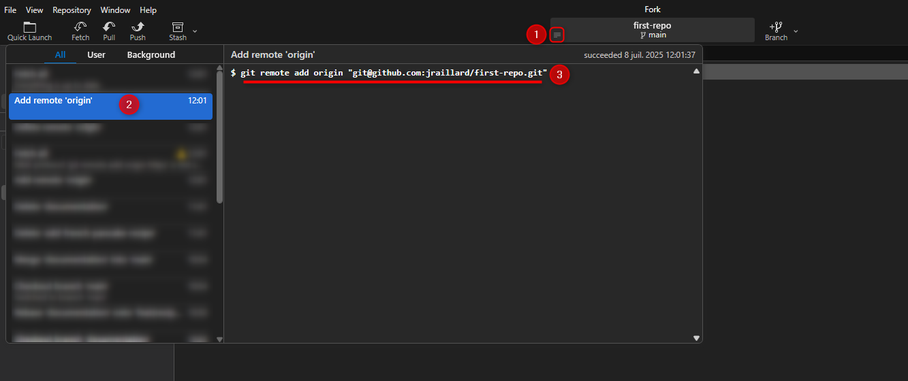

# Collaboration Essentials

Collaboration is where Git really shines. Here, you’ll set up remote repositories, learn how to pull changes made by others, and master common workflows like merging and rebasing.

You’ll also practice pushing your own changes to share your work with the world.

## Git Remotely

As we previously mentionned, **Git is a distributed version control**.

Meaning this technology allows us to have a `Remote repository` and multiple `Local repositories`.

But how to store those remote repository ?

&rarr; That's where **Git providers** comes in.

GitHub, GitLab, BitBucket, Azure Devops, they're plenty one ; here we'll be using **GitHub**.

## From Local to Remote

We already have a local repository, let's try to push it on GitHub. :rocket:

Go on GitHub to create an empty private repository :

Now whether you use SSH (secure one) or HTTPS (default one) on your GitHub account, get the remote git repository URL.

Come back to Fork and right click on **Remotes**, a dialog should opend :
- **Remote** indicate the label associated to the remote repository ; all branches that would stand in remote repository would be prefix by `remoteName/`

&rarr; By convention it is labelled as `origin` or `<prefix>Origin` if we have multiple remote repository associated (see [forks section](#forks)).

- **Repository URL** is where you should put the previously gathered URL.
- **Test connection** is a Fork GUI feature allowing us to see whether we have access to the remote repository locally
- **Add New Remote** to add the remote repository reference &rarr; click on it
    
    :bulb: Under the hood, what is done is basically run the command `git remote add origin <yourGitUrl>`. You can see it through the Fork GUI git commands history feature.

    

Well ... a new line appears under **Remotes** with GitHub Logo but nothing change on the repository commits graph :worried:

Sure &rarr; The remote repository is empty for now; let's push our local one. :rocket:

- Checkout the **main** branch
- Click on the **Push** button on the left-top corner
- Look at the dialog 

    

- Click on push to push your local branch to the remote repository
    
    &rarr; Doing a `git push` command under the hood

- Now look at the update repository commits graph; you should see the **GitHub Logo** in a card next to local main branch card
  
  :bulb: That means that **remote main branch (origin/main) is now sync with your local main branch**

Let's try to do the opposite now : doing a change on remote and sync our local environment.

Go back to GitHub on the **Code section**, edit the `file.txt` file adding whatever you want in it and commit the changes.

:warning: Commit directly to the main branch for this example, dont create a new branch.

Now return on Fork, you don't see you new commit right ? We need to `fetch it first`.

Click on the **Fetch button** on the left-top corner and select **Fetch** in the opened dialog.

**origin/main** is ahead on your **main** branch. To make them sync you have two ways : 
- using the **Pull button** on the left-top corner 
  - that's the git command to run under the hook
  - :warning: be carefull of being checked out your local main branch
- simply double click on **origin/main**
  &rarr; On Fork GUI, double click on a commit is doing a git checkout or git pull + git checkout whether you click on a local or remote branch

:bulb: Did you notice the `Create tracking reference` in the Push dialog previously ? That's what make Push / Pull / Fetch possible. Pushing a branch is basically sending the local branch commit reference to the remote repository and getting back the associated reference on the remote repository to make a binding.

## From Remote to Local

## Pull / Merge Request

## Forks

## Git next level
With collaboration down, it’s time to expand your toolkit with advanced Git commands and features.

➡️ Explore the next step [here](./step4_advanced_git.md).