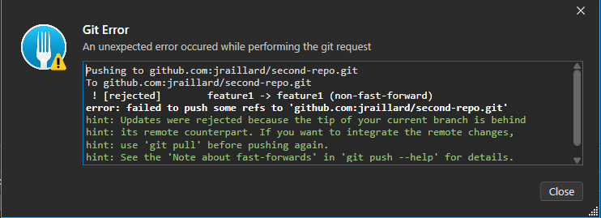

# Collaboration Essentials

Collaboration is where Git really shines. Here, you’ll set up remote repositories, learn how to pull changes made by others, and master common workflows like merging and rebasing.

You’ll also practice pushing your own changes to share your work with the world.

## Git Remotely

As we previously mentionned, **Git is a distributed version control**.

Meaning this technology allows us to have a `Remote repository` and multiple `Local repositories`.

But how to store those remote repository ?

&rarr; That's where **Git providers** comes in.

GitHub, GitLab, BitBucket, Azure Devops, they're plenty one ; here we'll be using **GitHub**.

## From Local to Remote

We already have a local repository, let's try to push it on GitHub. :rocket:

Go on GitHub to create an empty private repository :


Now whether you use SSH (secure one) or HTTPS (default one) on your GitHub account, get the remote git repository URL.


Come back to Fork and right click on **Remotes**, a dialog should opend :
- **Remote** indicate the label associated to the remote repository ; all branches that would stand in remote repository would be prefix by `remoteName/`

&rarr; By convention it is labelled as `origin` or `<prefix>Origin` if we have multiple remote repository associated (see [forks section](#forks)).

- **Repository URL** is where you should put the previously gathered URL.
- **Test connection** is a Fork GUI feature allowing us to see whether we have access to the remote repository locally
- **Add New Remote** to add the remote repository reference &rarr; click on it
    
    :bulb: Under the hood, what is done is basically run the command `git remote add origin <yourGitUrl>`. You can see it through the Fork GUI git commands history feature.

    

Well ... a new line appears under **Remotes** with GitHub Logo but nothing change on the repository commits graph :worried:

Sure &rarr; The remote repository is empty for now; let's push our local one. :rocket:

- Checkout the **main** branch
- Click on the **Push** button on the left-top corner
- Look at the dialog 

    

- Click on push to push your local branch to the remote repository
    
    &rarr; Doing a `git push` command under the hood

- Now look at the update repository commits graph; you should see the **GitHub Logo** in a card next to local main branch card
  
  :bulb: That means that **remote main branch (origin/main) is now sync with your local main branch**

Let's try to do the opposite now : doing a change on remote and sync our local environment.

Go back to GitHub on the **Code section**, edit the `file.txt` file adding whatever you want in it and commit the changes.

:warning: Commit directly to the main branch for this example, dont create a new branch.

Now return on Fork, you don't see you new commit right ? We need to `fetch it first`.

Click on the **Fetch button** on the left-top corner and select **Fetch** in the opened dialog.

**origin/main** is ahead on your **main** branch. To make them sync you have two ways : 
- using the **Pull button** on the left-top corner 
  - that's the git command to run under the hook
  - :warning: be carefull of being checked out your local main branch
- simply double click on **origin/main**
  &rarr; On Fork GUI, double click on a commit is doing a git checkout or git pull + git checkout whether you click on a local or remote branch

:bulb: Did you notice the `Create tracking reference` in the Push dialog previously ? That's what make Push / Pull / Fetch possible. Pushing a branch is basically sending the local branch commit reference to the remote repository and getting back the associated reference on the remote repository to make a binding.

## From Remote to Local

Imagine the following situation : you're being hired on a company with an existing project you should work on.

In that case you shouldn't create a local repository and push to the remote one (you'll not be allowed to).

Instead you'll `clone it`.

Come back to GitHub and create a new repository called `second-repo`.

&rarr; **Make it public**

&rarr; Check the option `Add a README file`

Then also add file into it called **file.txt** with the following text : **spoiler alert : it's still a useless file**.

Now go on the **Code tab** and click on the blue **<> Code** button.

Select whether HTTPS / SSH as you did previously and copy the URL.

At this point you have two options : 
:one: Clone the repo in the common way using git commands 
  
  &rarr; Open a terminal in a folder where you want to clone the repo and run the command `git clone <remoteUrl>`

:two: Clone the repo using Fork GUI
  - On the left-top corner click on **File / Clone**
  - Paste the URL in the **Repository URL** field
  - Select the parent folder (where the repository directory will be created)
  - Fill the **Name** field which contains the repository directory on your computer
  
    &rarr; By default it's the name of your repository 

    :bulb: That's why repository naming advice to use only lowercase letters, hyphens and numbers

Et voilà ! You're now able to whether initiate or clone a remote repository. :sparkles:

## Pull / Merge Request

Previously we created branch and merge it into the main branch alone.

In real-world we don't do this : default branch and some special branches (we'll see it [later on](./step5_branching_strategies.md)) are protected.

Meaning that we can't directly push changes to it, we must do a `pull request` (or `merge request`, both terms are used nowadays) containing our changes. Then when it's accepted, changes are merge to the targeted branch.

Protect a branch and enforce those requests allows several things such as: 
- Many persons cannot edit the same branch at the same time
- Some can review the changes before accepting it for merge
- Additionnal treatments check could be done automatically (security, unit tests, linting, building artifacts, etc.)

Ok so let's do it ! Create our first **GitHub ruleset**. :rocket:

Go back to GitHub and switch to the **Settings tab**.

Select **Rulesets** under the **Rules** dropdown list, click on the **New ruleset button** and fill the form as follows before click on **Create** button :


&rarr; The core works is done on the third capture when we setted up both requiring pull request before merging and block force pushes (meaning we can't rewrite the targeted branch).

:bulb: Options are here to ensure a **manual approval is required** and every** changes to the branch where we made a pull request on triggers a new approval checks**. Also **conversation**, the GitHub feature to make reviews on the code, **should always be resolved** before accepting a pull-request. **Allowed merge methods** is an option to tell how the repository graph (or history) should look like after pull-request resolve : we put **squash** in it ([others are also allowed](https://docs.github.com/en/repositories/configuring-branches-and-merges-in-your-repository/configuring-pull-request-merges/about-merge-methods-on-github)). It's a common way of doing it as it result into a single commit for every changes included in a pull-request ; keeping the history clean in medium to large size project.

Let's try then ! On your local machine :
- Edit `README.md` for instance
- Checkout main branch
- Commit changes
- Try to push ... :bomb:

    &rarr; Error message is clear : you're violating repository rules and therefore are not allowed to push

    :bulb: Not that if we didn't checked the option **Block force pushes** on Github Ruleset, we could have bypass this error message by checking **Force push** option on the Fork Push dialog.

Now do it properly by creating a branch called **feature/doc** on top of you main local branch ; so that it contains you're previous commit.

Push it to GitHub and create a Pull-Request on the **Code tab** by clicking on **Compare & pull request** button.

&rarr; Here you're allowed to add title, description but moreover specify the targeted branch you want to make the pull-request into.

Look through the Pull Request tabs : **Conversation, Commits, Checks, Files Changed**. They allows you to add global reviews or specific to one piece of code.

> **TLDR :** On GitHub, for security concerns, even an owner isn't allowed to approve its own Pull-Request ; you should add other people to check your work. Therefore when you work alone on a repository, just skip the **Require a pull request before merging**. You can still keep branch protection and check for status check if you add CI-CD pipelines though (one subject of the [next course](https://github.com/jraillard/parkndeploy)).

So update you're previously created ruleset to remove the mentionned option and after close the pull request. :broom:

On fork then delete **local main branch** and double click on the remote (in order to make them sync as they don't have same commits now). Also delete the `feature/doc` and `origin/feature/doc` branches if you didn't do it while resolving pull-request.

## Forks

Little aside about what `Forks` are.

It's being used on almost all **open source projects** and sometimes in big **companies**.

A fork is a personal copy of someone else’s repository on a Git provider (GitHub for instance). It allows you to freely experiment and make changes without affecting the original project. You can later propose your changes back to the original repository via a pull request.

Optionnaly you can follow the official [Github Fork practice](https://docs.github.com/en/pull-requests/collaborating-with-pull-requests/working-with-forks/fork-a-repo) in order to test this feature. :eyes:

Keep in mind that in most companies, it's not being used as it add another level of complexity.

## Conflict management

Here's the **most important git feature**. 

Remember what we saw at first hand about **distributed version control** tool ?

> **Conflict management is their main issue.** :bomb:

Why is it ? Let's see with a sample : 

- create a branch **feature1**
- add the following text at the end of **file.txt** : **The pen is red.**
- create another branch **feature2**
- add the following text at the end of **file.txt** : **The pen is blue.**
- push both branches to origin
- create a pull-request only from **feature1** to main and merge it
- then create a pull-request from **feature2** to main and ... boom ! :bomb:

    &rarr; Your gitgraph should now look like this : 

    ```mermaid
    gitGraph
    commit id: "commitA" tag: "main"
    branch feature1
    commit id: "commitB" tag: "feature1"
    checkout main
    branch feature2
    commit id: "commitC" tag: "feature2"
    checkout main
    merge feature1
    merge feature2 id: "conflict" type: HIGHLIGHT
    ```

To solve this conflict management you'll have two ways : 
- `merge` **main** into **feature2**
- `rebase` **feature2** to the last commit from **main**

&rarr; We already saw the difference between those but i'll put **my personnal opinion** on it :

> Prefer `rebase` when you make a pull-request on protected branch ; prefer `merge` when you make a pull-request on unprotected branch. 

:one: **Rebase make sure every changes are applied commit by commit** instead of ignoring branch history and computing one big changes between branches (which might be critical for protected branches).

:two: In terms of **git graph visual** : unprotected branches come from and go into protected branches; protected branches are never "injected" into others.

:three: Rules :one: and :two: are fair enough no ? :innocent:

So practice it : **rebase** **feature1** on the last main branch commit and push it to origin.

&rarr; Here a **conflict** banner should appear on top of Fork GUI, just click on `Resolve` to be redirected to the **Conflict management tab**.s


Finally push **feature1** to remote ... **Wait what** ?! :neutral_face:



Did you understand the displayed error ? :confused:

&rarr; What the remote repository is telling us is that you're trying to push **feature1** branch that has now for **parent commit** the **pull-request merge commit** you just resolved whereas on the remote, the parent commit is still the first commit you initially pushed.

> In other words : your **local feature1 reference is different from the origin/feature1 reference**.

:bulb: That's where `force push` option comes in handy !

When your local branch history has diverged from the remote (for example, after resolving conflicts or rewriting commits), a force push (`git push --force`) lets you overwrite the remote branch with your local changes, syncing them up.

***Just be careful force pushing can overwrite others' work if you're collaborating, so use it thoughtfully!***

Retry to push by checking the `Force push` in the dialog and you should now be allowed to resolve your pull-request without error conflicts. :star2:

## Git next level

With collaboration down, it’s time to expand your toolkit with advanced Git commands and features. :eyes: 

➡️ Explore the next step [here](./step4_advanced_git.md).