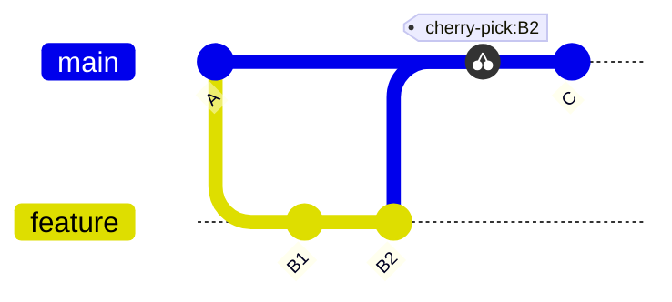
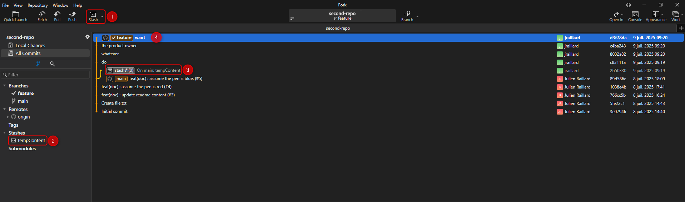
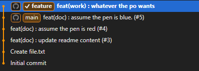

# Advanced Features & Special Commands

Git offers powerful tools to keep your history clean and your workflow efficient.

In this step discover handy commands like stash, cherry-pick, and interactive rebase. 

We'll also take a look about interesting features such as : git hooks, git LFS and git submodules.

These features help you manage complex scenarios and optimize your development process.

## Handy commands

### Cherry-pick

The `git cherry-pick` command allows you to apply a specific commit from one branch onto another.  
This is useful when you want to selectively incorporate changes without merging entire branches.

In the following situation, we're **cherry-picking** content from **commit B2 from the feature branch** into the **main branch** witout merging the **feature branch**.

:bulb: In Fork you can do it by checking out on the branch you want to apply the commit on, right-click on the commit to cherry-pick and select **cherry-pick commit** in the context menu. You also have option to automatically create a commit or just apply the changes so that you have the control through working directory and stage staging areas over changes to apply or not. Meaning you can do **partial cherry-pick commit**.

### Stash

`git stash` temporarily shelves (or “stashes”) changes you've made to your working directory so you can work on something else, then come back and reapply them later.

Here's an example : 

:zero: Made some changes on file.txt while being checked out on main branch. The product owner, at this time, called me to switch on a brandly new feature.

:one: My changes were minor so creating a stash, with the **Stash button** on left-top corner, would be enough (no need to create a temporary branch).

:two: The stash appears on the left side under **Stashes** accordion.

:three: The stash appears also in the gitgraph, with main as parent commit.

:four: I can now freely develop my feature, the PO is happy :smiley:

&rarr; After this I would be able to re-apply changes contained inside the stash by checking out a commit (wherever I want to apply the stash content), right-clicking on the stash and select **Apply** in the context menu.

:bulb: Fork also gives you the possibility to automatically destroy the stash after or not.

### Interactive rebase

`Interactive rebase` (git rebase -i) lets you rewrite commit history: reorder, squash, edit, or drop commits to keep a clean and meaningful history.

&rarr; For sure it is an **awesome** tool as you could clean a branch at anytime.

:warning: ***Great powers comes with great responsabilities*** :eyes: better use this feature on your own branches, be sure to not break others ...

&rarr; As an example rework the feature branch in the [stash topic](#stash) so that it contains only one commit named **feat(work) : whatever the po wants**. The commit should contains changes from every commits before(**do**, **whatever**, **the product owner** and **want** ).

> In order to do an interactive rebase on Fork, basically right-click **on the commit before the branch you want to rebase** and play with the context menu. :smirk:

You should end up with this :

## Advanced features

This parts aims to give you some resources and knowledges about advanced features that you might face. If you want to dive deeper in it, follow the links provided.

### Git hooks

`Git hooks` are custom scripts, with whatever language you want, that run automatically on certain Git events (e.g., commit, push, rebase, etc.). They help enforce policies, automate tasks, or integrate with other tools. For example a pre-commit hook to run tests or linters before committing.

Remember the `./git/hooks` we mentionned earlier in this course ? That's where the magic stand. :eyes:

&rarr; You just have to create a file named with the git event targeted, pre-commit for instance, add a script to execute in it, et voilà !

:warning: Two important things to know though : 
- Git hooks might not work if you're on windows for [several fixable reasons](https://kaylumah.medium.com/using-c-code-in-your-git-hooks-66e507c01a0f)
- We can [skip Git hooks manually](https://medium.com/pipeline-pulse/how-to-skip-git-commit-hooks-52b276233052) so people could just ignore it

**Official docs** :
- [Customizing with Git Hooks](https://git-scm.com/book/en/v2/Customizing-Git-Git-Hooks)
- [Husky homepage](https://typicode.github.io/husky/) - the most popular alternative to native git hooks

### Git LFS

`Git Large File Storage` (LFS) replaces large files such as images or videos with lightweight references in Git, storing the actual content on a remote server.

This helps keep your repository lightweight and performant.

Remember a project where you stored large pdf, excel or even web image in your source code ? On first hand it seems handy, in long terms your repository size increase unnecessarily and common commands takes longer time. 

&rarr; **Use Git LFS for this**, if you don't suffer from its [limitations](https://learn.microsoft.com/en-us/azure/devops/repos/git/manage-large-files?view=azure-devops).

**Official docs** : 
- [Git LFS](https://git-lfs.com/)
- [Medium article about Git LFS](https://medium.com/slickteam/pourquoi-et-comment-utiliser-git-lfs-771bcda478d0)
- [Microsoft Learn article about Git LFS](https://learn.microsoft.com/en-us/azure/devops/repos/git/manage-large-files?view=azure-devops)
- [Fork support for LFS](https://git-fork.com/blog/#:~:text=Add%20ability%20to%20lock/unlock%20LFS%20files)

### Git submodules

Here's a very neat git fonctionnality.

`Git submodules` allow you to embed one Git repository (the **submodule**) as a folder inside another repository (the **superproject**). This setup enables you to track an external project or dependency at a specific commit within your main project.

***Unlike simply copying files, submodules preserve the independent history and lifecycle of the embedded repository, making updates and collaboration more manageable.***

&rarr; This is useful to include and track dependencies or third-party libraries as separate projects if you don't want to integrate them as a npm, maven or nuget package for instance.

How does that work :question:

Under the hood, **the superproject stores a reference** to a specific commit of the submodule repository in a special **file called .gitmodules** and in the Git index.

:warning: Some drawbacks to mention : 
- **Submodules must be explicitly cloned and updated** : When someone clones your repository, they need to run **git submodule update --init --recursive** to fetch all submodule content (if you dont have an awesome GUI ... :smirk:).
- **Committing inside submodules only affects the submodule repo** : Changes to a submodule need to be committed and pushed separately before updating the superproject’s reference.
- **Submodules add complexity** : They can complicate workflows (merging, branching) and confuse new users, so evaluate if they’re the best option compared to alternatives like subtrees or package managers.

**Official docs** : 
- [Git Tools - Submodules](https://git-scm.com/book/en/v2/Git-Tools-Submodules)
- [Fork support for git submodules](https://git-fork.com/blog/page/3/#:~:text=Open%20a%20submodule%20next%20to%20the%20active%20tab)

## Git Worklows

Next up, learn how to organize your work and teamwork with effective branching strategies.

:arrow_right: Proceed to the [final step](./step5_branching_strategies.md).