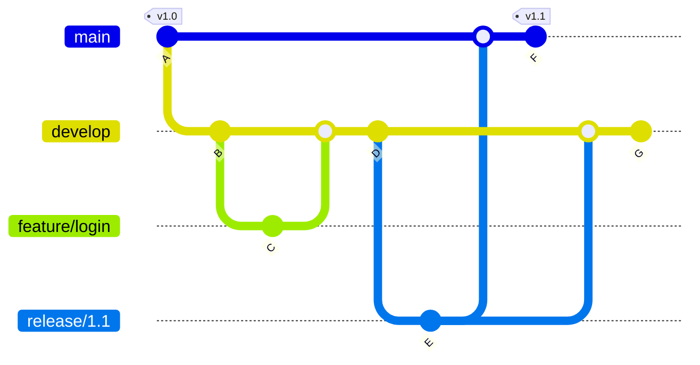
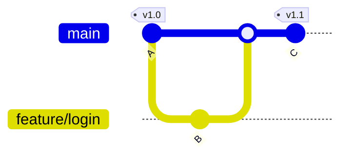
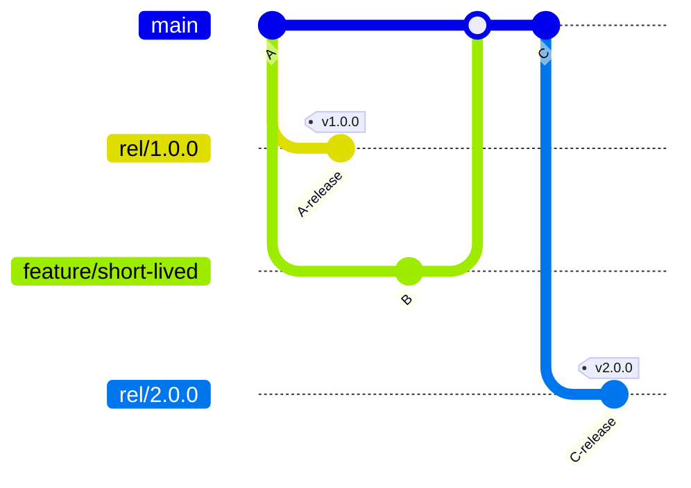

# Branching strategies

Branching is the backbone of modern Git workflows. 

This step covers popular strategies like Git Flow, GitHub Flow, and trunk-based development.

You’ll learn the pros and cons of each to be able to make your team productive and your codebase stable.

Also we'll discuss about naming conventions, they're optionnal and not widely use / always respected but ensuring consistency and clarity is a key to maintain a healthy repository.

## Workflows

Choose of each strategy is up to the team : **one does not rule the others**. One might also mix them to adapt to the situation &rarr; **there's no silver bullet even there**.

### Git Flow

`Git Flow` is a strict branching model designed for managing large projects with planned release cycles.

It uses multiple **long-lived branches** like `main` and `develop` (meaning they're never deleted), with **short-lived branches** like `feature`, `release`, and `hotfix` branches branching off and merging back in a structured way.

:thumbsup: **Pros :**

- `Well-defined roles` for branches and releases.
- `Supports parallel` development and release management.
- Great for teams that do `scheduled releases`.

:thumbsdown: **Cons :**

- Can be `complex and heavy for small teams or continuous deployment setups`.
- Multiple merges can create `overhead` and `conflicts`.

### GitHub Flow

`GitHub Flow` is a simpler, more lightweight workflow **popularized by GitHub**. 

**Development happens on feature branches created from main**. Once ready, a pull request is opened, reviewed, and merged directly into main. **Deployments usually happen continuously from main**.

:thumbsup: **Pros :**

- **Simple and easy to understand**.
- **Encourages continuous integration** and delivery.
- **Fast** feedback and **deployment cycles**.

:thumbsdown: **Cons :**

- **Less structured for managing releases or hotfixes**.
- Can be **risky if main is always deployable but not stable**.

### Trunk-based development

Trunk-based development **emphasizes small, frequent commits directly to a single main branch called trunk or main**.

There are **typically no long-lived release branches**. Instead, code is continuously integrated into the trunk (or main) branch. Releases are often created directly from a **trunk** or either by tagging a specific commit.

To **manage incomplete features without blocking releases**, developers commonly use **feature flags (or feature toggles)**. This allows new code to be merged early but hidden or disabled in production until it's ready to be released.

When ready, the current trunk commit is tagged as a release (e.g., v1.2.0). Hotfixes are typically done by fixing directly on trunk and releasing immediately.

> :bulb: **Note  :** a trunk isnt necessarily the main branch. For instance if you need to support multiple release version at the same time you could consider creating multiples **rel/*** branches (**trunks**) and add tag them. You then just have to report changes to the main branch and later releases branches.

:thumbsup: **Pros :**

- **Fast and flexible releases**, supporting continuous delivery.
- **No overhead** of managing separate release branches.
- **Reduces merge conflicts related to long-lived branches**.

:thumbsdown: **Cons :**

- **Requires a mature automated testing and deployment pipeline**.
- **Feature flags add complexity** and require careful management.
- **Less formal control over release staging** compared to dedicated release branches.

## Naming conventions

### Semantic versionning

[SemVer](https://semver.org/spec/v2.0.0.html) also known as `Semantic versionning` is a popular versionning scheme that is commonly used in IT development.

The pattern consist of the following : `X.Y.Z-<optional-labels>`
- `X` is a **major** number increment. Upgrading it could mean **backward incompatibility or partial**. 
  
  &rarr; Think about Android versions for instance.

- `Y` is a **minor** number increment. This one are for **functionnality updates** and should ensure **backward compatibility**.

    &rarr; Think about video games with seasons functionnality (major update), you can have additionnal features added during its launch (minor updates).

- `Z` is a **patch** number increment. It would handle **bugfixes** versionning for a minor update and should ensure **backward compatibility**.

- `<optional-labels>` is where SemVer allows **flexibility**. As a guidance it recommands adding : **pre-release+build**
  - `pre-release` allows to differentiate a released version from a version that aims to be but still need some tests with a **fixed-label**. For instance we could have `alpha`, `beta`, `rc` (release-candidate), etc. **It depends on your delivery process.**
  - `+build` allows to differentiate multiple version with the same **MAJOR.MINOR.PATCH** version and same **fixed-label** by adding a **unique identifier** from your **solution build** (which could be a GUID or partial for instance)

You can read more about on the [official doc](https://semver.org/spec/v2.0.0.html).

&rarr; Teams are free to use it or not, it's giving guidance but the final goal is to ensure consistency and clarity.

### Commit naming

Commit naming is often a total jungle. You probably already saw that, you did that, I did too.

It is not a problem in small to medium project. It's getting worse on bigger one when you need to travel around repository trying to understand what have been done, why a commit "mysteriously disappeared" and so on.

The one I would recommend you to use is `Conventionnal Commits`.

To quote it `Conventionnal Commits dovetails with SemVer, by describing the features, fixes, and breaking changes made in commit messages.`

There's no better explanation than the official one so if you are inclined to change, check out the [doc](https://www.conventionalcommits.org/en/v1.0.0/#specification).

:bulb: The `BREAKING CHANGE` marker might be the must underrated thing in this convention but could literally spare your time if you use it well.

&rarr; Again developpers are free to use it or not, it's giving guidance but the final goal is to ensure consistency and clarity.

### Branches naming

That totally up to the team there's no "official guidance" in there.

As a good starting point you could follow those simple rules :
- branches are **written like file path**
- branches name **start with a type** : feat (feature), hotfix, fix, prd (prod), rel (release), etc.
- feature / fix branches should **specify** whether an **US** (User story), a **ticket coming from whatever tool** or **describe shortly what is fix / added** 
- branches related to version should specify the version 
  
  &rarr; Example : hotfix/1.0.1 branches aims to fix the version 1.0.1 of our solution

Those rules in mind, here is a list of valid branch names : 
- feat/jira-12345
- feat/client-dashboard
- hotfix/1.0.1
- **[trunk-based dev specific]** rel/1.0.z &rarr; on this **trunk** we could have version 1.0.0, 1.0.1, 1.0.2, etc.

&rarr; For the last time (I promise :pray:) teams are free to use it or not, it's giving guidance but the final goal is to ensure consistency and clarity.

--- 

Congratulations you just ended this workshop ! :sparkles:

With these skills, you’re ready to Git done right and confidently move whether into [git additional resources](./to_go_further.md) or [DevOps initiation course](https://github.com/jraillard/parkndeploy). :eyes:

Whatever, I hope you enjoyed this course as much as me to produce it. :metal:

Feel free to leave me a comment on my [email adress](mailto:ju.raillard@hotmail.fr) or on my [LinkedIn](https://www.linkedin.com/in/julien-raillard/). :blush:

You can also leave a star on this Github Repository to make it more visible. :pray:

Thank you for following along, and happy coding! :computer: